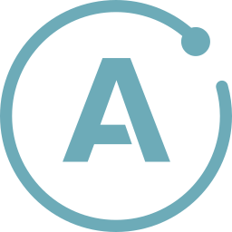
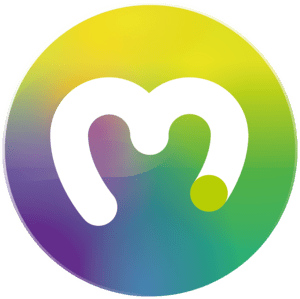
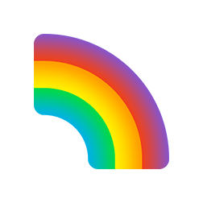
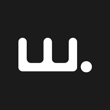
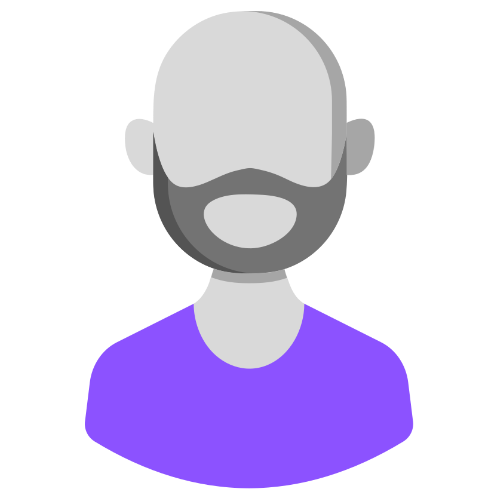

 

 

---

  
### Quick Links
  

  

  
 
  
  

---

## Welcome to Oyster!

Fresh-off-the-blockchain NFT market insights, with custom portfolios and galleries. 

---

 

[ABOUT](#-about) • 
[INSTALLATION](#installation) • 
[USE](#use) • 
[DEMO](#demo) • 
[TECH STACK](#tech-stack) •
[MEET THE DEVELOPERS](#meet-the-developers) • 
[CONTACT US](#contact-us) 

 
## About

Oyster is an exciting new way for NFT collectors and creators to explore the digitable collectables market. With Oyster, users can view real-time NFT metadata from the blockchain. 

To unlock even more features, users can sign up and create a watch list of their favorite NFTs. Users can also connect their wallet and view their own NFT gallery.

Looking to connect? Users can join our Oyster community to discuss and share projects with other collectors and artists. 

 Our application uses the MERN stack with GraphQL, Apollo Server, and Apollo Client. Please see our [tech stack](#tech-stack) below for an expanded list of technologies used.  

 

## Installation

* Download or clone the repository. 
* Open the application using a CLI, 
* `npm i`
* `npm run develop`

## Use

* To use, Oyster, simply visit our [website](). 
* To view NFT collections, navigate to the `Products` button, and select how you would like to sort the collections. 
* Don't forget to click `sign up` and log in to explore all Oyster has to offer. 
* If you don't have a wallet, Oyster will easily guide you through the process by selecting `Connect Wallet`

 

## Demo

 

 

## Tech Stack
Select an icon to learn more about each technology in our stack. 

### MERN Stack 
<a href="https://www.mongodb.com/" target=""> 
<a href="https://expressjs.com/" target="">
<a href="https://reactjs.org/" target="">

 

### Additional Technologies
<a href="https://axios-http.com/" target="">
<a href="https://www.apollographql.com/" target="">
<a href="https://graphql.org/" target="">
<a href="https://www.npmjs.com/" target="">

 

### Web3 Technologies
<a href="https://moralis.io/" target="">
<a href="https://metamask.io/" target="">
<a href="https://www.rainbowkit.com/" target="">

 
 

## Meet the Developers

</a> </a></a>

Hi there! We are the Serial Coders, grads from the [Univerisity of Central Florida](https://github.com/UCF-Coding-Boot-Camp) who developed Oyster as our final project. We hope you enjoy our application, and invite you to check out our other projects! 
### [Beth DeCarlo](https://github.com/bethdecarlo)- Front End Developer
### [Jose Barreto](https://github.com/joseobm92)- Full Stack Developer
### [Youssef Ojeil ](https://github.com/youssefojeil)- Full Stack Developer

 

## Contact Us

We love hearing from users and developers! Please reach out to [our team](mailto:bethdecarlo@gmail.com,joseobm92@gmail.com) if you have any questions or comments about Oyster. 

 
